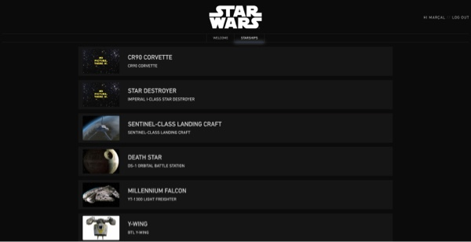
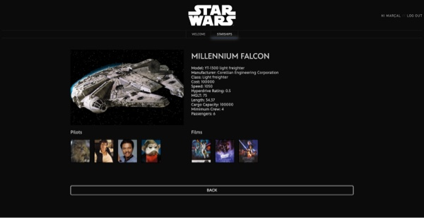
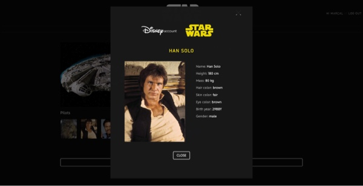

# S8. Star Wars - Starships viewer

## Description

This app was created as the 8th exercise from IT Academy - Barcelona.

In this app you will be able to see all information about a Star Wars Starship. 

## Screen shots

## How to install

1. Clone this repository 
    > `git clorn https://github.com/chaiben/s8-swapp.git`
2. Access the app directory
    > `cd swapp`
3. Delete the package-lock.json if present.
4. Install all 
    >`npm install`
5. Run
    >`npm start`

## Code Quality

